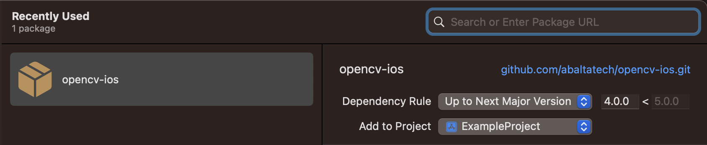

# opencv-ios

This is a swift package that exposes opencv2.xcframework built from the official [OpenCV](https://github.com/opencv/opencv) github repository. This simplifies the process of importing the prebuilt opencv2.xcframework into your project, eliminating the need for manual building.

## Installation

To use `OpenCV` in your own project, you can:   
Set it up as a package dependency
```swift
// swift-tools-version:5.6
import PackageDescription

let package = Package(
  name: "MyPackage",
  dependencies: [
    .package(
      url: "https://github.com/abaltatech/opencv-ios.git", 
      .upToNextMajor(from: "4.7.0") // or `.upToNextMinor
    )
  ],
  targets: [
    .target(
      name: "MyTarget",
      dependencies: [
        .product(name: "OpenCV", package: "opencv-ios")
      ]
    )
  ]
)
```
Add https://github.com/abaltatech/opencv-ios.git to your package dependencies 
  

## Usage
Include the c++ headers
```c++
#include <opencv2/opencv.hpp>
```

